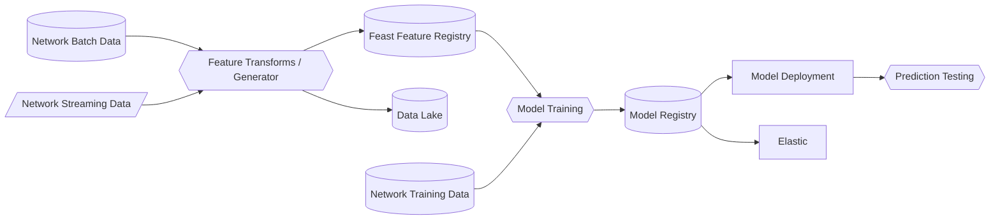

```mermaid
flowchart LR
    NBD[(Network Batch Data)]
    NSD[/Network Streaming Data/]
    NBD --> FTG{{Feature Transforms / Generator}}
    NSD --> FTG
    FTG --> FR[(Feast Feature Registry)]
    FTG --> DL[(Data Lake)]
    FR --> ModTrn{{Model Training}}
    NTD[(Network Training Data)] --> ModTrn
    ModTrn --> MR[(Model Registry)]
    MR --> MD[Model Deployment]
    MD --> PD{{Prediction Testing}}
    MR --> Elastic[Elastic]
```